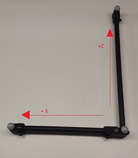
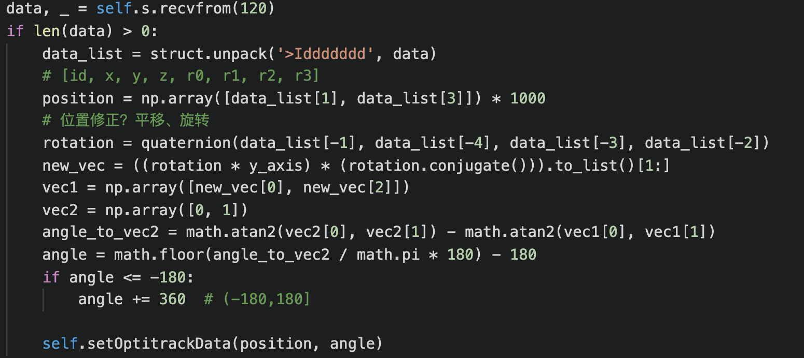

## 坐标系说明

### 相关数据

以下数据均在【SLAM的地图坐标系】中：

（1）路线的坐标

（2）用户的坐标和朝向

### 坐标系轴向定义

 Z-axis is forward, Y-axis is up, X-axis is left

https://v22.wiki.optitrack.com/index.php?title=Tracking_Bar_Coordinate_System

### 用户坐标与朝向数据格式

使用C结构体，格式如下：

|      | I               | d      | d      | d      | d      | d      | d      | d      |
| ---- | --------------- | ------ | ------ | ------ | ------ | ------ | ------ | ------ |
| 含义 | id(直接是1即可) | x      | y      | z      | r0     | r1     | r2     | r3     |
| 长度 | 4               | 8      | 8      | 8      | 8      | 8      | 8      | 8      |
| 格式 | unsigned int    | double | double | double | double | double | double | double |

r0~r3是四元数的分量

#### python中如下解析用户坐标数据：

相关信息：

https://docs.python.org/zh-cn/3/library/struct.html

https://gist.github.com/kevinkindom/108ffd675cb9253f8f71